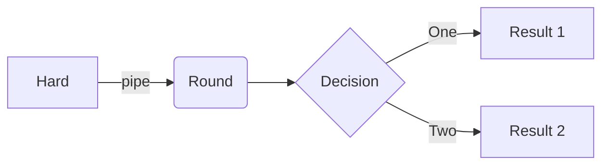

> This is my portfolio showcasing my cybersecurity projects and expertise.
{: .prompt-tip }

# **Linux Security Projects**

## **Penetration Testing**

nmap -sS -O target_network



```
flowchart LR
A[Hard] -->|pipe| B(Round)
B --> C{Decision}
C -->|One| D[Result 1]
C -->|Two| E[Result 2]
```