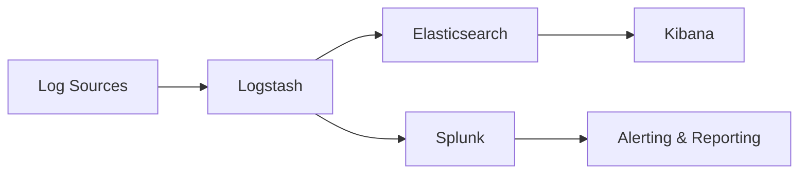

# SOC Defense Lab Project

Built a comprehensive Security Operations Center defense lab for training and threat detection.

## Overview
This project involved setting up a complete SOC environment with log aggregation, threat detection, and incident response capabilities.

## Technologies Used
- **SIEM**: Splunk Enterprise
- **Log Management**: ELK Stack (Elasticsearch, Logstash, Kibana)
- **Network Security**: Suricata IDS, Zeek network monitor
- **Virtualization**: VMware vSphere

## Key Features
- Real-time log aggregation from multiple sources
- Custom detection rules for advanced threats
- Automated incident response workflows
- Threat intelligence integration

Your project details here...

```bash
# Example command to start Suricata
sudo suricata -c /etc/suricata/suricata.yaml -i eth0
```


