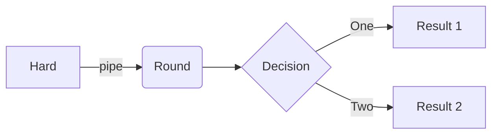

> Add Markdown syntax content to file `_tabs/about.md`{: .filepath } and it will show up on this page.
{: .prompt-tip }

`sudo && cat file.txt`sdsd

# **Linux**

## **First heading**

## second heading

### third heading

```console

title: TITLE
date: YYYY-MM-DD HH:MM:SS +/-TTTT
categories: [TOP_CATEGORY, SUB_CATEGORY]sdsdsdsd
tags: [TAG]     # TAG names ssdsd always be lowercaseasdssadsadsdsad

```
new


sdsddasdsdsdsddasdsdadsdadasdas123sdsdsdsds22323

## **third heading**
```console


asdasd


asdasd


```

#### **third heading**


## third heading


## third heading


## third heading

# third heading


## third heading


### third heading


# third heading


## third heading


### third heading


# third heading


## third heading


### third heading


# third heading


## third heading


### third heading

